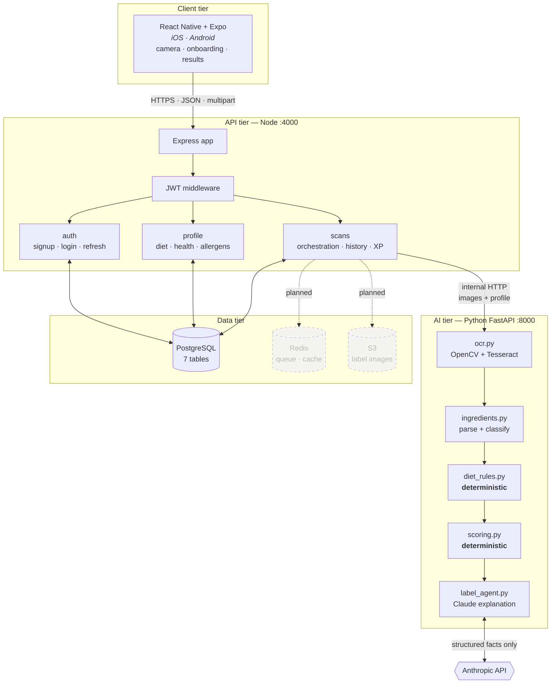
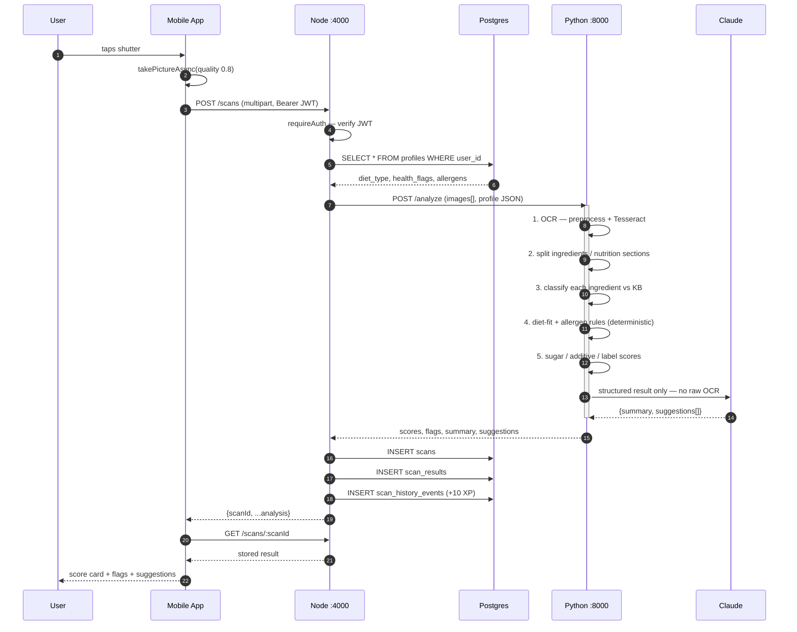
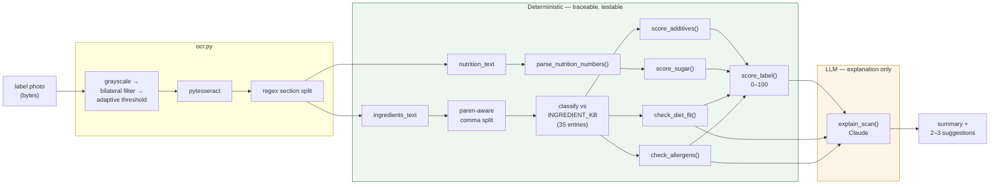
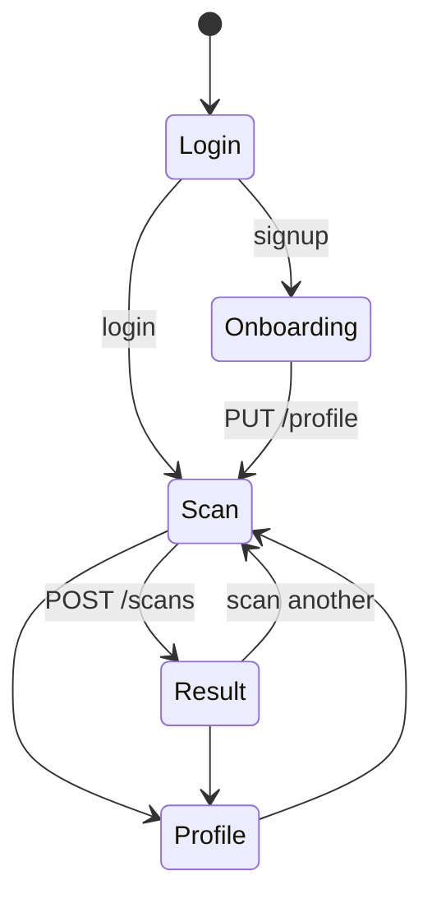
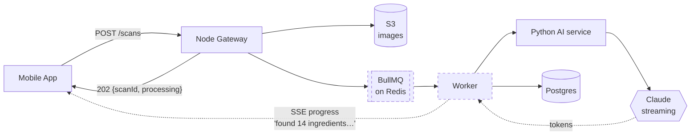

# ScanBite — Architecture Diagrams

Companion to [`ARCHITECTURE.md`](ARCHITECTURE.md). These diagrams describe the
system **as currently built** (milestone-1 scaffold). Components that are
planned but not yet implemented are drawn with dashed borders.

---

## 1. System context



**Why two backend services:** Node owns the mobile-facing REST contract, auth,
and sessions. Python owns OCR/NLP/LLM orchestration, where the ecosystem is
strongest. They scale independently — the AI service is the CPU-heavy one.

---

## 2. Scan request sequence

The single most important flow in the app.



> **Known inefficiency:** step 1 is fully synchronous — one blocking call with a
> 30 s axios timeout — and the app discards the analysis it already received in
> order to re-fetch by id. Phase 3 replaces this with a job queue plus SSE
> progress events.

---

## 3. The analysis pipeline

Where the domain logic actually lives, and where the deterministic/LLM boundary sits.



**Scoring formulas** — deliberately simple so they can be explained to a user:

| Score | Formula |
|---|---|
| Sugar | `100 − (added_g ÷ 25 g) × 100` |
| Additives | `100 − 15 × count(sweetener, preservative, colorant, flavor enhancer)` |
| Label | `mean(sugar, additives)` − 20 if diet mismatch − 30 if allergen hit |

---

## 4. Data model

```mermaid
erDiagram
    users ||--o| profiles : "has one"
    users ||--o{ scans : "creates"
    scans ||--|| scan_results : "produces"
    users ||--o{ scan_history_events : "earns"
    scans ||--o{ scan_history_events : "triggers"

    users {
        uuid id PK
        text email UK
        text password_hash
        text display_name
        timestamptz created_at
    }
    profiles {
        uuid user_id PK_FK
        text diet_type
        text_array meat_subprefs
        text_array health_flags
        text_array allergens
        numeric sugar_sensitivity
        text age_band
        text sex
        text activity_level
    }
    scans {
        uuid id PK
        uuid user_id FK
        text_array image_urls "always empty — no S3 yet"
        text status
        text ocr_raw_text
        timestamptz created_at
    }
    scan_results {
        uuid scan_id PK_FK
        numeric label_score
        numeric sugar_score
        numeric additive_score
        numeric diet_fit_score
        jsonb flags
        text ai_summary
        jsonb ai_suggestions
    }
    scan_history_events {
        uuid id PK
        uuid user_id FK
        uuid scan_id FK
        int xp_earned
        text badge_unlocked
    }
    ingredients_kb {
        uuid id PK
        text canonical_name
        text_array synonyms
        text category
        text e_number
        bool animal_derived
        bool root_allium
    }
    diet_rulesets {
        uuid id PK
        text diet_type
        int version
        jsonb rules
    }
```

`ingredients_kb` and `diet_rulesets` are created by the schema but **no code
reads or writes them** — that data currently lives as hardcoded Python dicts.
Migrating it into these tables is Phase 1 of the roadmap.

---

## 5. Mobile navigation



A flat native-stack — no tab bar and no persisted-session check, so the app
always cold-starts at `Login` even when a valid token exists in AsyncStorage.

---

## 6. Target architecture (Phase 3+)

What the synchronous pipeline above becomes once the queue and streaming land.



The SSE channel is what makes the agent narration in
[`labelwise-prototype.html`](../../../labelwise-prototype.html) real: today those
lines are a 650 ms `setInterval`; they should be actual pipeline stage events.
